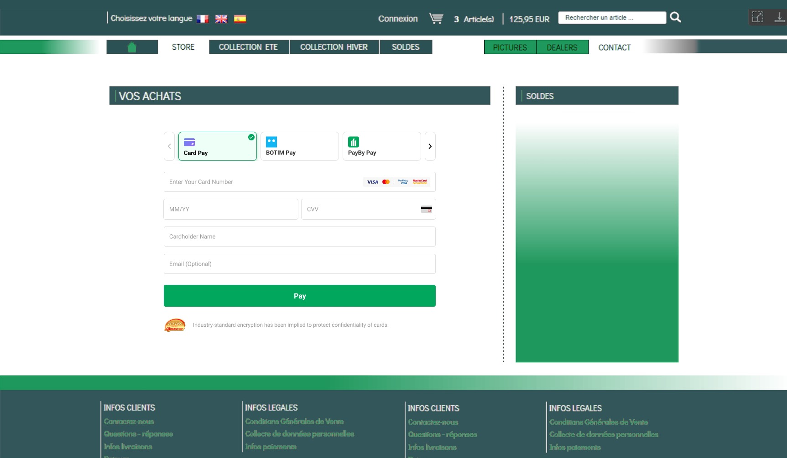

import IframePayPage from "@site/src/components/IframePayPage"

# Iframe Paypage

The **Iframe Payment Page** is a secure checkout interface hosted by **PayBy**, designed to be embedded directly into your website. While the payment is processed on PayBy’s secure servers, the transition is seamless and invisible to the cardholder, ensuring a smooth user experience.

---

## Embedded Checkout Preview

If your site integrates the iframe paypage, it will appear like this:

---

## Try It Yourself

To simulate the payment process:

1. **Fill in the Required Fields**  
   Enter the payment details in the form below.

2. **Click “Pay Now”**  
   This will initiate the payment flow using the embedded iframe.

3. **Use Test Credentials**  
   For testing purposes, use the bank and PayBy account credentials provided in the test environment.  
   Find the APK and account details [here](/demos/testaccount).

<IframePayPage/>
