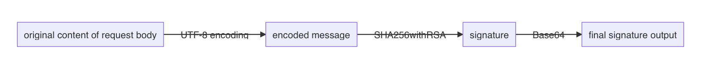

# Get Started

This document provides an overview of the process to start accepting payments using PayBy.

## Learn About PayBy Products

PayBy offers various payment products to meet different payment scenarios. You can integrate online payment, offline payment, web payment, and mobile payment solutions based on your business needs.

To learn more about available products and access requirements, review the Product Introduction and visit the developer documentation.

## Create a Test Account and Apply for Payment Products

You need to create a test merchant account and apply for the products you want to use in the test environment.

- Create test merchant: https://uat-web-merchant.test2pay.com/
- Apply for products: https://uat-web-merchant.test2pay.com/products/all-products

PayBy processes applications on weekdays upon receipt. For special requirements, contact merchant@payby.com directly.

## Configure the API Key

After your account is activated, download PayBy's public key and upload your own public key.

Configuration portal: https://uat-web-merchant.test2pay.com/management/api-key

PayBy uses asymmetric encryption to verify signatures. Asymmetric cryptography, or public-key cryptography, uses pairs of keys: a public key (which can be shared) and a private key (which must remain confidential).

### Merchant Public Key

The merchant generates a key pair where the private key remains with the merchant and the public key is uploaded to the PayBy system. When sending requests to PayBy, the merchant signs the request with its private key, and PayBy uses the merchant's public key to verify the signature. Successful verification confirms that the request was sent by the merchant and not forged by others.

You can generate a key pair directly on the PayBy portal. The public key is automatically saved in the PayBy system, and you can download the private key. Store the private key securely. If your private key is lost, update the key in PayBy immediately. You can also generate keys using other OpenSSL tools.

### PayBy Public Key

PayBy generates a key pair for each merchant. PayBy stores the private key, and the public key is available on the portal for merchants to download. When PayBy sends responses, PayBy signs the message with its private key, and the merchant uses PayBy's public key to verify the signature. Successful verification confirms that the response was sent by PayBy and not forged by others.

### IP Whitelist

PayBy only allows API requests from whitelisted IP addresses. You must configure the IP whitelist; otherwise, API calls will fail with an error. You can set one or more whitelist IPs. To allow any IP address, enter `*`.

## Verify in the Test Environment

### Sign a Request

The preferred signature algorithm is SHA256withRSA, an efficient asymmetric encryption method. This algorithm first calculates a unique hash of the input data using the SHA256 algorithm, then encrypts the hash with a private key using the RSA algorithm.

Merchants need to generate a private key and public key pair using OpenSSL. After generating the key pair, share the merchant's public key with PayBy so that sent messages can be validated by PayBy. You should also obtain PayBy's public key for future use cases.

When ready to send an API request, sign the request message with the merchant's private key. When encryption is required per API specifications, encrypt the message with PayBy's public key so that PayBy can decrypt it with their private key.

To ensure all messages are properly verified and decrypted, request messages need to be encoded and decrypted using the same algorithm. All requests must follow this process when generating signatures:

1. Process the entire request body as a signature
2. Use UTF-8 to encode the original message
3. Generate SHA256withRSA signature
4. Use Base64 to encode the signature generated in step 3
5. Use the signature generated in step 4 for all requests in the HTTP Header

Sometimes you need to encrypt the request payload or fields to prevent man-in-the-middle attacks. When encrypting, use RSA encryption with PayBy's public key. The encrypted field should not be too large (usually no more than 200 bytes) to ensure timely decryption.

If the request is sent successfully, PayBy returns a response where `applystatus` = `success` and `code` = `0`.

Try making a request call to verify whether your configuration is successful. If the call fails and you cannot determine the reason, contact merchant@payby.com, and the technical team will help resolve the problem.

### Request Header Format

When sending a request to PayBy, the request content includes HTTP Header and HTTP Body. In most requests, the HTTP Header should be formatted as follows:

- **Content-Language** String  
  - The language for the response message. Currently, only English is supported.  
  - Example value: en  
  - Maximum length: <code>10</code>

- **Content-Type** String Required  
  - The media type. Required for operations with a request body.  
  - The value is `application/json`.  
  - Example value: application/json

- **sign** String Required  
  - Sign requests using private-key cryptography.  
  - This allows the payment gateway to verify that an incoming request is from your application.

- **Partner-Id** String Required  
  - The merchant ID of your account.  
  - Example value: 200001200101  
  - Maximum length: <code>12</code>

### Response Header Format

When PayBy sends a response, the response content includes HTTP Header and HTTP Body. In most responses, the HTTP Header should be formatted as follows:

- **sign** String Required  

  When PayBy sends a response, it uses its private key to sign the message. The merchant uses PayBy's public key to verify the signature. Successful verification confirms that the response was sent by PayBy and not forged by others.

### Response Body Header Format

When PayBy sends a response, the response content includes HTTP Header and HTTP Body. The HTTP Body consists of head and body sections. In most responses, the body should be formatted as follows:

- **applyStatus** Enum Required  
  The result of the request. Possible values are:  
  - `SUCCESS` – Application successful  
  - `FAIL` – Application failed. Check the <code>code</code> and <code>msg</code> for the exact reason  
  - `ERROR` – Application error. The signature verification failed. Check whether the private key used for the signature and the public key uploaded on the PayBy portal are a key pair

- **code** String Required  

  - Response codes. View the <a href="/docs/response-code">Response Code</a> section to see all possible results.  
  - Example value: 0

- **msg** String  
  - Description of this code. View the <a href="/docs/response-code">Response Code</a> section to see all possible results.

- **traceCode** String  
  - Internal PayBy identifier used to locate errors.

## Build Your Integration

Choose your integration to match your business needs:

- **Checkout**: Hosted paypage, iFrame paypage, In-App SDK
- **Special payment scenes**: E-wallet, DYNQR, QRPAY, JSAPI, Direct pay
- **Fundout**: Transfer, Transfer to bank

## Go Live

After successfully verifying in the test environment and preparing to launch in the live environment, follow these steps:

1. Apply for production environment account: https://b.payby.com/
2. Enable production environment products: Contact sales to decide the products and rates at bd@payby.com
3. Configure production environment key: https://b.payby.com/management/api-key
