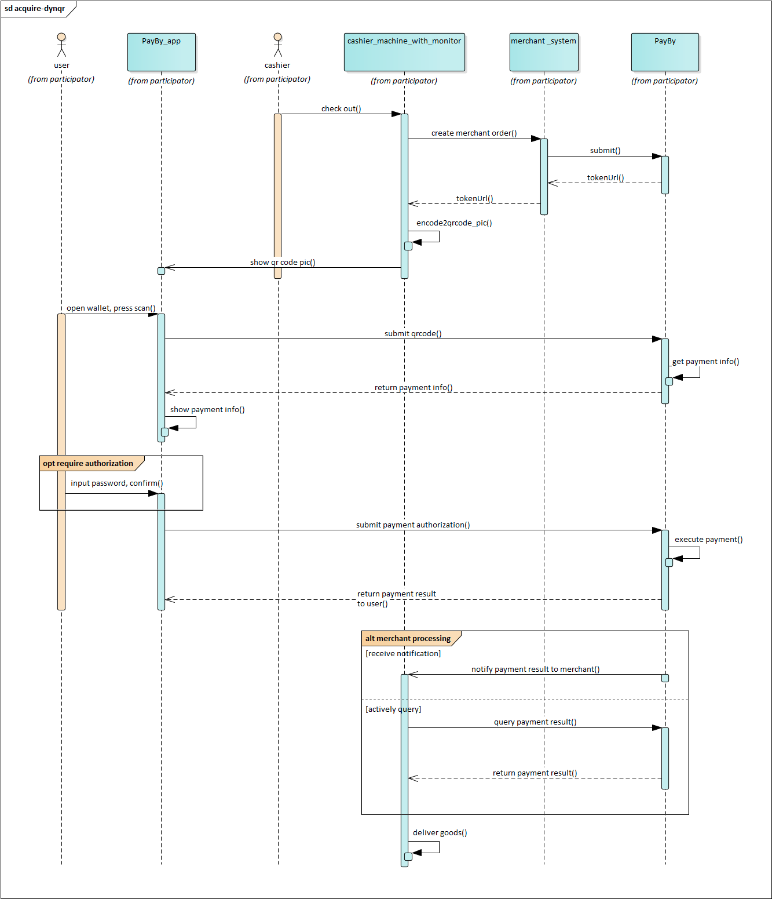

# DYNRQ

## Merchant-side QR Code

After a customer places an order, a dynamic QR code is generated on the merchant’s interface—whether it’s a website, mobile app, or even a physical terminal like a vending machine. The customer can then scan this code using the PayBy or BOTIM app to complete the payment.

This method is especially effective in environments where entering card details is impractical or insecure, such as vending machines or parking garages. By shifting the payment process from the merchant’s interface to the customer’s mobile device, it enhances both convenience and security.

QR code payments are inherently secure. The QR code itself serves only as a medium for encrypted data exchange, ensuring that sensitive payment information remains protected throughout the transaction.

## User Experience

1.  The customer confirms to pay for an order, the merchant generates a QR codes on the interface.
2. The customer uses PayBy, BOTIM to scan the QR code to obtain order information. 
3. In the order information returned by payby server, there is a parameter **tokenUrl**, PayBy or BOTIM application will parse this parameter and redirect the customer to the built-in checkout of the app.
4. Customers enter their payment details on the payment page and complete the transaction.
5. If the payment is completed, the customer will see the payment result on the app.

## Integrate the API

### Initiate Payment and Display QR Code

1. **Customer Confirmation**  
   Wait for the customer to confirm their intent to make a payment.

2. **Create Order Request**  
   Call the [Create Order](/docs/createorder) API.  
   - Follow the API documentation to construct the request.
   - Set the `paySceneCode` parameter to `DYNQR`.

3. **Handle API Response**  
   If the API call is successful:
   - Retrieve the `tokenUrl` from the response.

4. **Generate and Display QR Code**  
   - Convert the `tokenUrl` into a QR code image.
   - Display the QR code on the merchant's interface for the customer to scan.

5. **Payment Notification**  
   - After the customer completes the payment, PayBy will send the payment result notification to either the PayBy server or the BOTIM app.
   - The customer will see the payment result in the app.

### Asynchronous Notification

If the **notifyUrl** is set in the order creation request, after the transaction, PayBy will send payment result to the url.

### Change Order Status

You can initiate [Revoke](/docs/revoke), [Cancel](/docs/cancel), [Refund](/docs/refund) and other operations on the created order.

### Retrieve Order

To retrieve the order detail, call the [Retrieve Order Detail](/docs/retrieveorderdetail) API.

