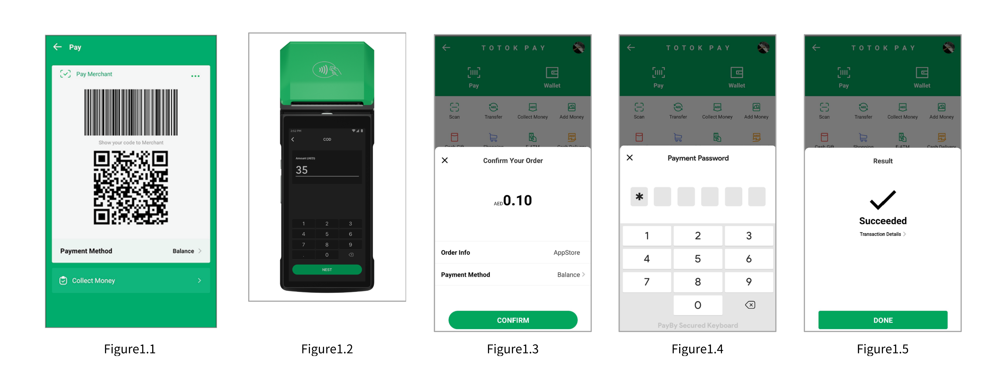

# QRPAY 

## Customer-side QR Code

QRPAY is a customer-presented QR code payment method designed for seamless in-person transactions. At checkout, once the total transaction amount is confirmed in your POS system, the customer opens the PayBy or BOTIM app and displays a QR code. The cashier then scans this code using a standard QR code scanner to complete the payment.

QRPAY is ideal for physical retail environments such as department stores, restaurants, and other service-oriented businesses. If your store is already equipped with barcode scanners and you do not intend to invest in additional hardware, integrating QRPAY offers a convenient way to accept payments from users of the PayBy and BOTIM apps, expanding your reach and enhancing customer experience

## User Experience

1. The customer opens PayBy or BOTIM app to present QR code.
2. The cashier confirms the payment amount, generates a payment order in the merchant’s system to place order in PayBy.
3. The merchant' cashier scans the customer's barcode / QR code with the code scanning equipment, and the merchant‘s POS system submits the payment.
4. Customers enter their payment details on the payment page and complete the transaction.
5. If the payment is completed, customers will be redirected to the merchant's success page.

## Integrate the API

### Initiate Payment via QR Code Using PayBy

1. **Customer Confirmation**  
   Wait for the customer to confirm their intent to proceed with the payment.

2. **Create Order Request**  
   Call the [Create Order](/docs/createorder) API.  
   - Construct the request according to the API documentation.  
   - Set the `paySceneCode` parameter to `QRPAY`.

3. **Receive Token URL**  
   If the API request is successful, PayBy will return a `tokenUrl`.

4. **Generate and Display QR Code**  
   - Convert the `tokenUrl` into a QR code image.  
   - Display the QR code on the merchant’s interface for the customer to scan.

5. **Payment Notification**  
   After the customer completes the payment:  
   - PayBy will notify the result to either the PayBy server or the BOTIM app.  
   - The customer will see the payment result within the app.

### Asynchronous Notification

If the **notifyUrl** is set in the order creation request, after the transaction, PayBy will send the payment result to the url.

### Change Order Status

You can initiate [Revoke](/docs/revoke), [Cancel](/docs/cancel), [Refund](/docs/refund) and other operations on the created order.

### Retrieve Order

To retrieve the order detail, call the [Retrieve Order Detail](/docs/retrieveorderdetail) API.

