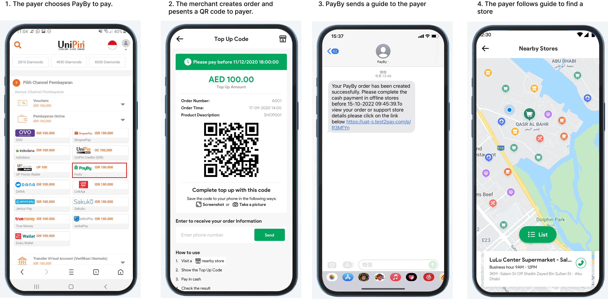
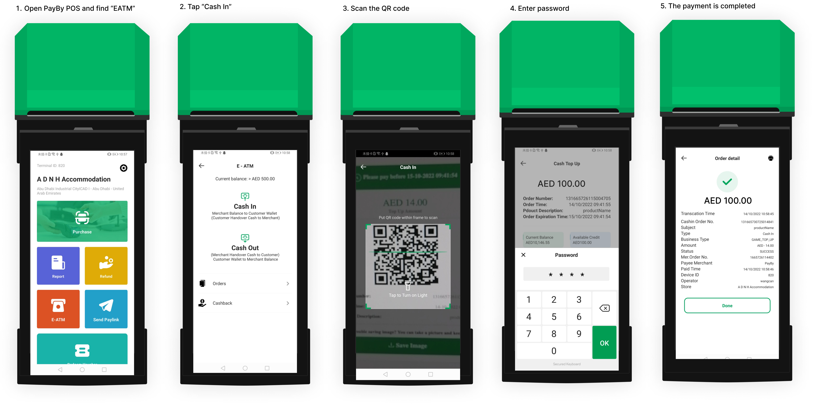

# Cash Top Up

This product enables online merchants to accept cash payments from customers who do not have bank accounts. It is especially useful in scenarios such as game account top-ups. In this process, the customer pays cash to a participating store cashier, who then completes the online transaction on their behalf. This solution bridges the gap between cash-based consumers and digital commerce, expanding access to online services.

## User Experience

1.  The customer confirms to add money to his or her online account, the merchant will generate an QR code for the payer's order. Along with the order, Payby will also send a how-to guide to the user's phone.
2.  The customer follows the guide, find a nearest store that running this business.
3.  The payer gives cash (same amount with the order amount) to cashier of the store, the cashier checks the cash then use PayBy POS to scan the QR code. In this process, the store's e-waller balance will be used to pay the payer's order.
4.  The payer will receive notification that the payment has been made, and the balance of the online account added.

## Payment Process

1. **Cash Collection & QR Scan**  
   The cashier verifies the cash amount provided by the payer. Once confirmed, the cashier uses the PayBy POS system to scan the QR code presented by the payer. A password is required to authorize the transaction.

2. **Transaction Execution**  
   Upon scanning, the PayBy backend system deducts the corresponding amount from the store’s PayBy account and updates the online order status to “Success.”

3. **Balance Verification**  
   It is essential for the cashier to ensure that the store’s PayBy account has sufficient balance before initiating the transaction. If the balance is insufficient, the payment cannot be completed.

## Integrate the API
### Cash Top-Up Payment Flow Using PayBy

Follow these steps to initiate and complete a cash top-up transaction:

1. **Create the Payment Order**.
  - When the customer confirms they want to pay, call the [Create Order](/docs/createorder) API.
  - Construct the request according to the API documentation.
  - Set the **`paySceneCode`** parameter to `CASHTOPUP` to indicate a cash top-up scenario.

2. **Generate and Display QR Code**.
  - If the API request is successful, PayBy will return a **`tokenUrl`**.
  - The merchant’s server should convert this URL into a QR code image.
  - Display the QR code to the customer on the merchant’s interface for scanning.

3. **Payment Completion and Notification**.
  - After the customer completes the payment, PayBy will send a notification to the merchant’s server with the transaction result.
  - The customer will also see the payment result on their mobile device.

### Asynchronous Notification

If the **notifyUrl** is set in the order creation request, after the transaction, PayBy will send payment result to the url.

### Change Order Status

You can initiate [Revoke](/docs/revoke), [Cancel](/docs/cancel), [Refund](/docs/refund) and other operations on the created order.

### Retrieve Order

To retrieve the order detail, call the [Retrieve Order Detail](/docs/retrieveorderdetail) API.

