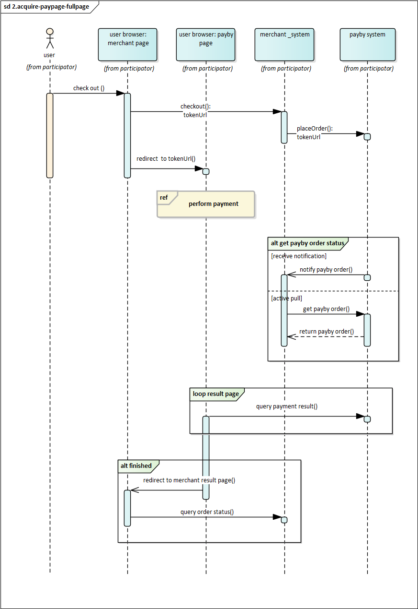

# E-wallet

Display one or more supported e-wallet icons on your mobile application’s checkout page to offer customers a seamless payment experience. Once a customer selects an e-wallet, they will be redirected to the corresponding app to complete the transaction.

Currently, PayBy supports the following e-wallets:
- BOTIM
- PayBy App
  
## User Experience

1. When customers are ready to complete their payment, your application creates a new order creation request.
2. The PayBy returns a URL that your APP can revoke the E-wallet's checkout through deeplink method.
3. Customers enter their payment details on the payment page and complete the transaction.
4. Upon successful payment, customers are redirected to the merchant's success page.

## Integrate the API
### Initiate E-Wallet Payment via PayBy

#### Step 1: Display E-Wallet Options
- When the customer confirms their intent to pay, render the list of available e-wallets.
- The selection and order of e-wallets are determined by the merchant and stored on the merchant's server.
- The merchant app must query the merchant's server to retrieve this list when the customer initiates payment.

#### Step 2: Create Payment Order
- Call the [Create order](/docs/createorder) API.
- Construct the request according to the API documentation.
- Set the `paySceneCode` parameter to `EWALLET`.

#### Step 3: Handle API Response
- If the API request is successful, PayBy will return a **deeplink**.
- Use this deeplink to redirect the customer to the selected e-wallet for payment.

#### Step 4: Redirect to Success Page
- Create a success page at the URL specified in the `redirectUrl` parameter.
- This page should display an order confirmation message to the customer.
- After the payment is completed via the e-wallet, PayBy will automatically redirect the customer to this success page.

### Asynchronous Notification

If the **notifyUrl** is set in the order creation request, after the transaction, PayBy will send payment result to the url.

### Change Order Status

You can initiate [Revoke](/docs/revoke), [Cancel](/docs/cancel), [Refund](/docs/refund) and other operations on the created order.

### Retrieve Order

To retrieve the order detail, call the [Retrieve Order Detail](/docs/retrieveorderdetail) API.

