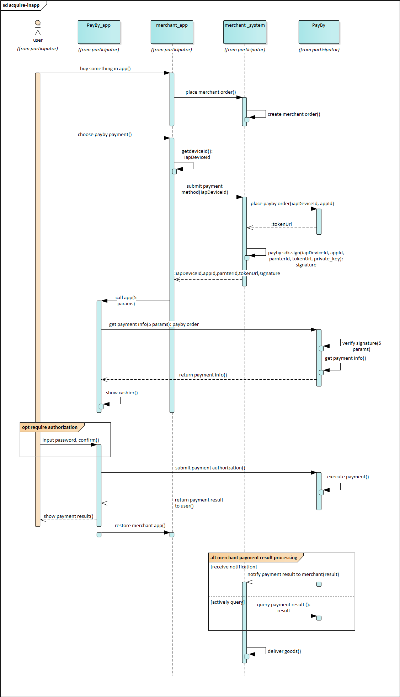

# In-App SDK for iOS

Payers will have the almost the same operation process for using **In-APP** and **Paypage**. The difference is that if the mobile client integrates the sdk, users will get a smoother experience when paying on the native page than a web page.


## User Experience

1. When customers are ready to complete their payment, your mobile application creates a new order creation request.
2. The PayBy returns a URL that that redirects customers to a checkout.
3. Customers enter their payment details on the checkout and complete the transaction.
4. If the payment is completed, customers will be redirected to the merchant's success page.

---


---

## System Interaction



## SDK

[Link](https://github.com/PayBy/PayBy-inApp-iOS)

## Term Definition

- **deviceId**  
    A unique identifier assigned to each device.  
    *UAT environment (joint debugging) fixed value:* `deviceId123`

- **partnerId**  
    An identifier assigned to each merchant during the application process for the payment service.

- **appId**  
    An identifier assigned to each app of a merchant during the application process for the payment service.

- **token**  
    A data object that contains order-related information.

- **sign**  
    A cryptographic signature generated in two steps:

    1. **Generate the sign string** by arranging the parameters in the following order:
       ```java
       String signString = "iapAppId=" + appId + "&iapDeviceId=" + deviceId + "&iapPartnerId=" + partnerId + "&token=" +             token;
       ```
    2. **Sign the sign string** using a private key. The encryption rules are provided in the demo.

    > **Note:** In the demo, the `sign` is generated on the app client for demonstration purposes. For production use, the         `sign` should be securely generated on the server and returned to the client.

## Applicable Version

Use Xcode 10 and above to use the new version of SLDPayByPayment SDK, iOS 10.0 and above

## Installation

### Installation with CocoaPods

1. **Build your project in Xcode.**
2. **Integrate `PXRPPayByPayment` using CocoaPods.**

   Add the following line to your `Podfile`:

   ```ruby
   pod 'PXRPPayByPayment'
   ```

   Save the file and run:

   ```bash
   pod install
   ```

   Then, open the project using the `.xcworkspace` file.

   > **Note:** If you are currently using `SLDPayByPayment`, replace it with `PXRPPayByPayment`, run `pod install`, and the new `SLDPayByPayment.framework` will be integrated into your project. The `SLDPayByPayment` pod is no longer maintained.

3. **Configure the URL scheme.**

   In Xcode, go to your project settings, select the **TARGETS** column, and under the **Info** tab, add a URL scheme to **URL Types** for your registered application.  
   Format: `payby` + `iapAppId`  
   
   [](https://github.com/PayBy/PayBy-inApp-iOS/blob/master/1661319255013.jpg)

4. **Set the architecture to `arm64`.**

   In Xcode, go to your project settings, select the **TARGETS** column, and under the **Build Settings** tab, change **Architectures** to `arm64`.  
   
   [](https://github.com/PayBy/PayBy-inApp-iOS/blob/master/1661244568047.jpg)

5. **Disable Bitcode.**

   In Xcode, go to your project settings, select the **TARGETS** column, and under the **Build Settings** tab, set **Enable Bitcode** to `No`.  
   
   [](https://github.com/PayBy/PayBy-inApp-iOS/blob/master/1661244707155.jpg)

## Usage

### Initialize SDK (Required)

```
#import "AppDelegate.h"
#import <SLDPayByPayment/SLDPayByPayment.h>

@implementation AppDelegate

- (BOOL)application:(UIApplication *)application didFinishLaunchingWithOptions:(NSDictionary *)launchOptions {
    // Override point for customization after application launch.
    [SLDPayByPaymentInterface setLogEnabled:YES];
    
//    [SLDPayByPaymentInterface setLanguage:SLDPayByPaymentLanguageEn];
//    [SLDPayByPaymentInterface setUserInterfaceStyle:SLDPayByPaymentUserInterfaceStyleDark];
//    SLDPayByPaymentConfig *config = [SLDPayByPaymentConfig defaultConfig];
//    config.paymentMethodMenuColor = [SLDPayByPaymentColor colorWithLightColor:[UIColor redColor] darkColor:[UIColor greenColor]];
//    config.paymentMethodTextColor = [SLDPayByPaymentColor colorWithLightColor:[UIColor whiteColor] darkColor:[UIColor blackColor]];
//    config.primaryColor = [SLDPayByPaymentColor colorWithLightColor:[UIColor blueColor] darkColor:[UIColor blueColor]];
//    config.appPayUseQrCode = NO;
//    config.useDefaultResultPage = YES;
//    [SLDPayByPaymentInterface updateConfig:config];

    [SLDPayByPaymentInterface initWithAppId:{appId} partnerId:{partnerId} environment:SLDPayByPaymentEnvironmentDevelop];

    ...

    return YES;
}

@end
```

SLDPayByPaymentEnvironment Description:

- SLDPayByPaymentEnvironmentDevelop: The environment for developing and testing.
- SLDPayByPaymentEnvironmentUAT: The environment for customer debugging.
- SLDPayByPaymentEnvironmentRelease: The environment for product online.


Call methods in your class (Objective-C)

```
NSString *sign = [NSString stringWithFormat:@"iapAppId=%@&iapDeviceId=%@&iapPartnerId=%@&token=%@", self.appIdTextField.text, self.deviceIdTextField.text, self.partnerIdTextField.text, self.tokenTextField.text];
[SLDPayByPaymentInterface paymentInViewController:self withToken:self.tokenTextField.text sign:[GPBRSA encryptString:sign privateKey:[GlobalDefines privateKey]] deviceId:self.deviceIdTextField.text resultCallback:^(NSString * _Nonnull result) {
    NSLog(@"resultCallback: %@", result);
    if ([SLDPayByPaymentConfig defaultConfig].useDefaultResultPage == NO) {
        [self showAlertWithMessage:result];
    }
}];
```

Call methods in your class (Swift)

```
let token = self.tokenTextField.text ?? ""
let deviceId = self.deviceIdTextField.text ?? ""
let sign = "iapAppId=\(self.appIdTextField.text ?? "")&iapDeviceId=\(deviceId)&iapPartnerId=\(self.partnerIdTextField.text ?? "")&token=\(token)"
SLDPayByPaymentInterface.payment(in: self, withToken: token, sign: GPBRSA.encryptString(sign, privateKey: GlobalDefines.privateKey()), deviceId: deviceId) { [weak self] result in
    print("resultCallback: \(result)")
    if SLDPayByPaymentConfig.default().useDefaultResultPage == false {
        self?.showAlert(with: result)
    }
}
```

### Payment Result Code Description

- `SUCCESS`: The payee has received the payment successfully, and the entire payment process for the order is completed.
- `FAIL`: Payment failed.
- `PAYING`: Processing. Wait for the payment process to complete and return the final payment result.
