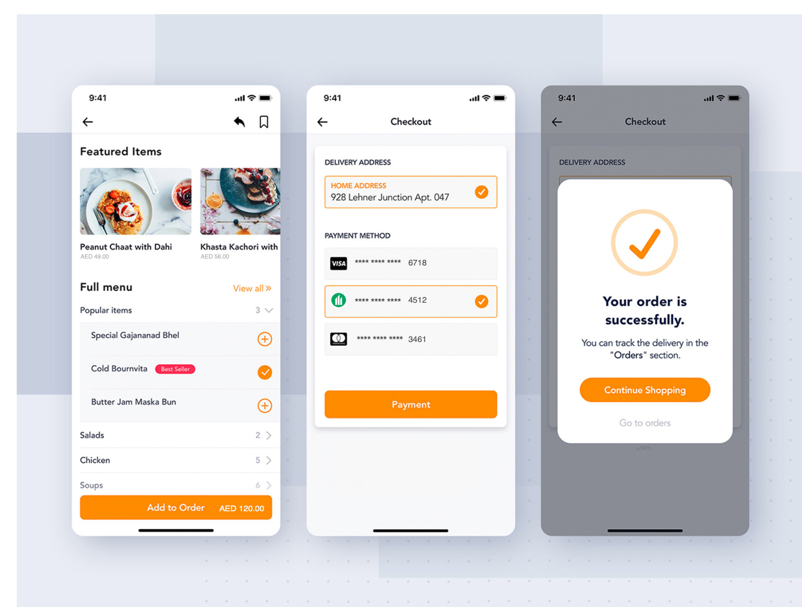
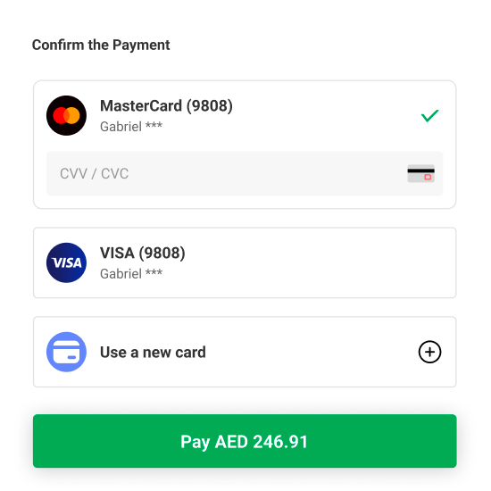

# Direct Pay

PayBy offers a secure and flexible API for merchants to integrate card payment functionality into their platforms. Customers enter their card details directly on the merchant’s interface to complete transactions. All card information is encrypted and securely stored by PayBy, enabling one-click payments for future purchases.

This solution gives merchants full control over the user interface design, allowing for a customized checkout experience while benefiting from PayBy’s secure payment infrastructure. It’s an ideal choice for businesses seeking a seamless and user-friendly card payment integration.

## User Experience

1. The customer confirms to pay for an order on the merchant's website or app.
2. If the customer is a new payer, he or she enters the card detail (Name, Card Number, CVV) to finish payment. If the customer has paid before and the merchant has stored the card details, just select the stored card and finish payment.
3. If the payment is completed, the customer will see the payment result on the merchant's website or app.

## Integrate the API
### Case 1: New Payer

1. **Display Card Input Fields**  
   When the customer confirms payment, display input fields for:  
   - **Bank Card Number**  
   - **Expiration Date**  
   - **Cardholder Name**  
   - **CVV**  
   

2. **Create Payment Order**  
   - Call the [Create Order](/docs/createorder) API.  
   - Follow the API documentation to construct the request.  
   - Set the `paySceneCode` parameter to `DIRECTPAY`.

3. **Payment Processing**  
   - If the request is successful, PayBy will forward the transaction to the bank and return the payment result to the customer.  
   - Ensure the **redirectUrl** parameter is set in your request. After payment, PayBy will redirect the customer to this URL to display a confirmation message.

4. **3DS Verification (Optional or Required)**  
   - In most cases, payment completes after card entry.  
   - If 3DS verification is required, PayBy will return a verification URL. Redirect the customer to their bank’s authentication page.  
   - The customer will enter a password or a code sent to their phone. Upon successful verification, the transaction proceeds.

5. **Controlling 3DS Verification**  
   - Use the `threeDSecure` parameter to indicate whether 3DS verification is required:  
     - `true`: PayBy returns a verification link.  
     - `false`: PayBy attempts direct debit.  
     > **Note**: PayBy may enforce 3DS verification based on its risk control system, even if `false` is passed.

6. **Saving Card for Future Use**  
   - Set the `saveCard` parameter to `true` to store the card.  
   - PayBy will return a **cardToken** (card ID), which can be used for future transactions.  
   - A customer ID can store multiple cards.

7. **Receive Payment Notification**  
   - If the `notifyUrl` is set in the request, PayBy will send the payment result to this URL after the transaction.

8. **Order Management**  
   - Use the following APIs to manage the order:  
     - [Revoke](/docs/revoke)
     - [Cancel](/docs/cancel)
     - [Refund](/docs/refund)   
     - [Retrieve Order Detail](/docs/retrieveorderdetail)

### Case 2: Returning Payer Using Saved Card

1. **Card Selection**  
   If the customer has previously saved a card, allow them to select it from the stored options.  

   

3. **Create Payment Order**  
   - Call the [Create Order](/docs/createorder) API.  
   - Set the `paySceneCode` parameter to `DIRECTPAY`.  
   - Pass the selected card’s **cardToken** in the `cardToken` parameter.

4. **Receive Payment Notification**  
   - If the `notifyUrl` is set, PayBy will send the payment result to the specified URL.

5. **Order Management**  
   - Use the following APIs to manage the order:  
     - [Revoke](/docs/revoke)
     - [Cancel](/docs/cancel)
     - [Refund](/docs/refund)   
     - [Retrieve Order Detail](/docs/retrieveorderdetail)
