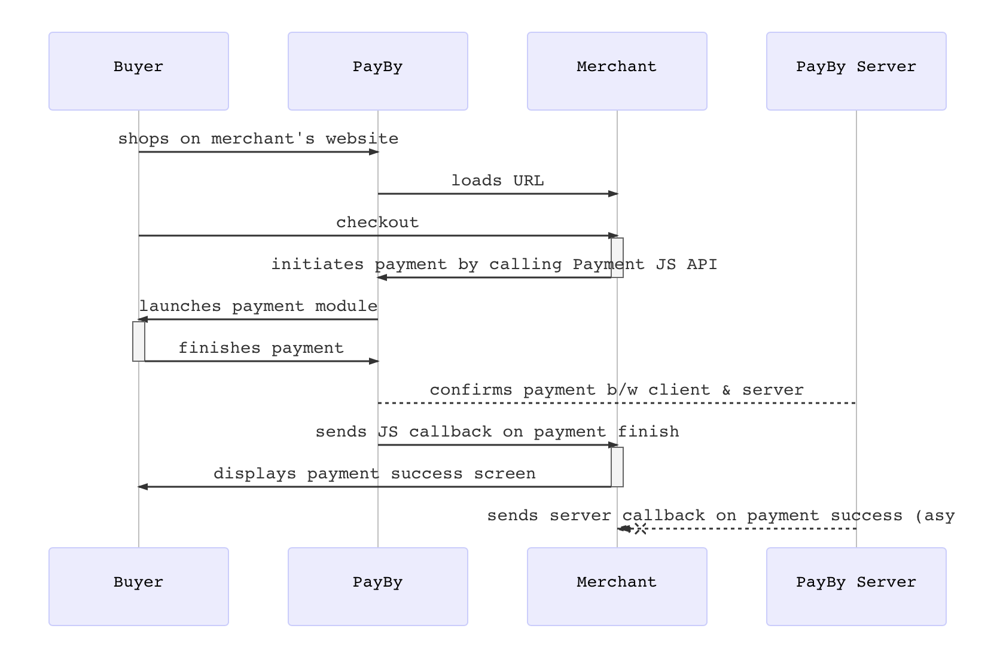

# JSAPI  

## Seamless Checkout via BOTIM & PayBy Integration

For merchants with a mobile website, this payment scenario enables a smooth checkout experience directly within the BOTIM app. When a customer opens your webpage through a message in BOTIM, the built-in PayBy checkout interface is automatically triggered, allowing the customer to complete their order and payment seamlessly.

This integration is especially beneficial if your customer base frequently uses the PayBy or BOTIM apps. It simplifies the payment process by eliminating the need to design a custom checkout interface—merchants only need to invoke the PayBy payment element, streamlining development and enhancing user convenience.

## User Experience

1.  The customer confirms to pay for an order, the merchant generates a QR codes on the interface.
2. The customer uses PayBy, BOTIM to scan the QR code to obtain order information. 
3. In the order information returned by payby server, there is a parameter **tokenUrl**, PayBy or BOTIM application will parse this parameter and redirect the customer to the built-in checkout of the app.
4. Customers enter their payment details on the payment page and complete the transaction.
5. If the payment is completed, the customer will see the payment result on the app.

## Integrate the API

### Initiate Payment via Dynamic QR Code Using PayBy

1. **Customer Confirmation**  
   Wait for the customer to confirm their intent to proceed with the payment.

2. **Create Order Request**  
   Call the [Create Order](/docs/createorder) API.  
   - Construct the request according to the API documentation.  
   - Set the `paySceneCode` parameter to `DYNQR`.

3. **Receive Token URL**  
   If the API request is successful, PayBy will return a `tokenUrl`.

4. **Redirect to Built-in Checkout**  
   - The PayBy or BOTIM app will parse the `tokenUrl`.  
   - The customer will be automatically redirected to the app’s built-in checkout interface to complete the payment.

5. **Payment Notification**  
   After the payment is completed:  
   - PayBy will notify the result to either the PayBy server or the BOTIM app.  
   - The customer will see the payment result displayed in the app.

### Asynchronous Notification

If the **notifyUrl** is set in the order creation request, after the transaction, PayBy will send payment result to the url.

### Change Order Status

You can initiate [Revoke](/docs/revoke), [Cancel](/docs/cancel), [Refund](/docs/refund) and other operations on the created order.

### Retrieve Order

To retrieve the order detail, call the [Retrieve Order Detail](/docs/retrieveorderdetail) API.

