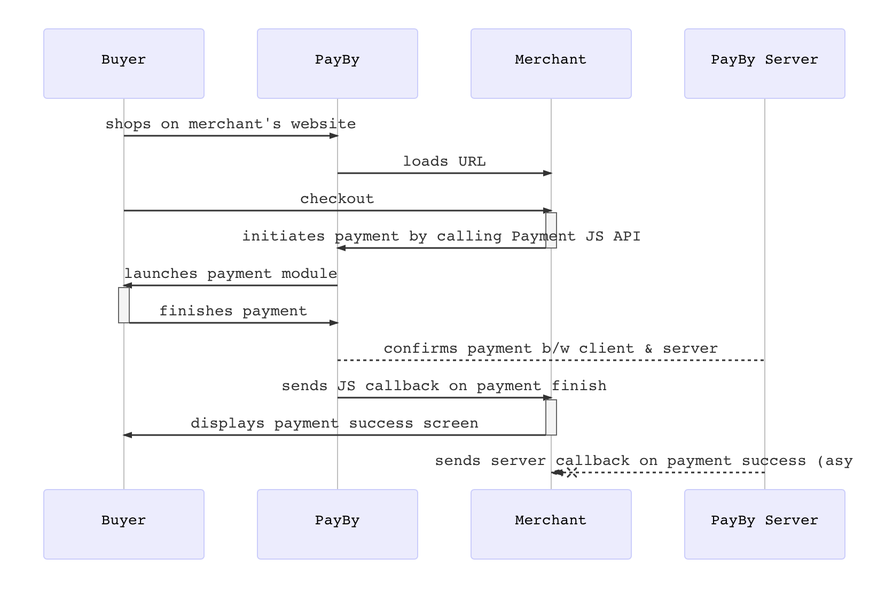

# JSAPI  

**BOTIM & PayBy built-in checkout**

The merchant has an mobile website, when the customer opens the webpage in BOTIM through a message, the built-in checkout  will be invoked to complete the order and purchase process.

If your customers have many installed PayBy or BOTIM app, integrating this payment scenario can help them complete their payments more conveniently. Using this payment method, you don't need to design the checkout interface, just call up the payby payment element.

 

### User experience

1.  The customer confirms to pay for an order, the merchant generates a QR codes on the interface.
2. The customer uses PayBy, BOTIM to scan the QR code to obtain order information. 
3. In the order information returned by payby server, there is a parameter **tokenUrl**, PayBy or BOTIM application will parse this parameter and redirect the customer to the built-in checkout of the app.
4. Customers enter their payment details on the payment page and complete the transaction.
5. If the payment is completed, the customer will see the payment result on the app.

 

### Integrate the API

#### Create order

When the customer confirms to pay, call the [Create order](/docs/createorder) API,  follow the API description to create a request. Pass `DYNQR` in the **paySceneCode** parameter.

 

If the request is successful, PayBy will return the **tokenUrl**. PayBy or BOTIM application will parse this parameter and redirect the customer to the built-in checkout of the app.

 

After the payment the payby server will notify the result to PayBy or BOTIM app, and the customer will see the payment result on the app.

 

#### Asynchronous notification

If the **notifyUrl** is set in the order creation request, after the transaction, PayBy will send payment result to the url. 

 

#### Change Order Status

You can initiate [Revoke](/docs/revoke), [Cancel](/docs/cancel), [Refund](/docs/refund) and other operations on the created order.

 

#### Retrieve Order

To retrieve the order detail, call the [Retrieve Order Detail](/docs/retrieveorderdetail) API.

 

