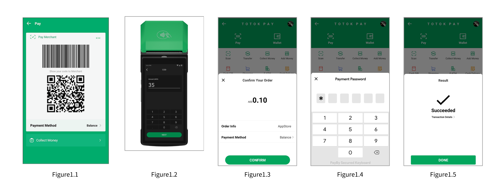

# QRPAY 

**Customer presented QR code**

QRPAY is the Customer-Presented QR code payment. When the total transaction amount is confirmed in the your POS system at checkout, your customer opens PayBy or BOTIM app to present QR code. The cashier in your shop scans this code with a QR code scanner, finalizing the transaction. QR Pay is suitable for in-person payment collection in stores such as department stores, restaurants, etc.  

If your store is already equipped with barcode scanners and you don't plan to use other types of hardware, integrating this payment product can help you reach out to users who have PayBy or BOTIM apps installed.

 

### User experience

1. The customer opens PayBy or BOTIM app to present QR code.
2. The cashier confirms the payment amount, generates a payment order in the merchant’s system to place order in PayBy.
3. The merchant' cashier scans the customer's barcode / QR code with the code scanning equipment, and the merchant‘s POS system submits the payment.
4. Customers enter their payment details on the payment page and complete the transaction.
5. If the payment is completed, customers will be redirected to the merchant's success page.

 

### Integrate the API

#### Create order

When the customer confirms to pay, call the [Create order](/docs/createorder) API,  follow the API description to create a request. Pass `QRPAY` in the **paySceneCode** parameter.

 

If the request is successful, PayBy will return the **tokenUrl**. The merchant's server needs to convert the URL into an QRcode image and display it to customers on its interface.

 

After the payment the PayBy server will notify the result to PayBy or BOTIM  app, and the customer will see the payment result on the app.

 

#### Asynchronous notification

If the **notifyUrl** is set in the order creation request, after the transaction, PayBy will send payment result to the url. 

 

#### Change Order Status

You can initiate [Revoke](/docs/revoke), [Cancel](/docs/cancel), [Refund](/docs/refund) and other operations on the created order.

 

#### Retrieve Order

To retrieve the order detail, call the [Retrieve Order Detail](/docs/retrieveorderdetail) API.

 

